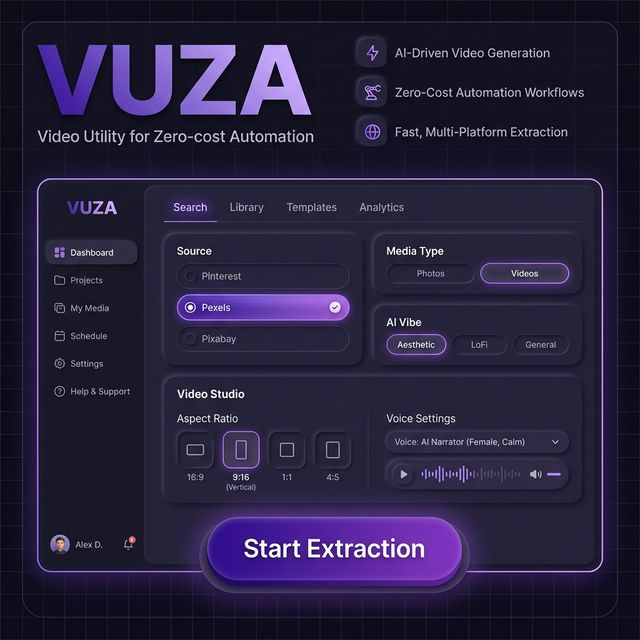

<div align="center">

# 🎬 VUZA — Free AI Video Creator & Faceless Video Generator

### A Working, Open-Source Alternative to Pictory AI, InVideo AI & MoneyPrinter Turbo — That Actually Works End-to-End.

[](https://colab.research.google.com/github/AliRash3ed/VUZA-Free-AI-Video-Creator-and-Pinterest-Video-Scraper/blob/main/vuza_colab.ipynb)
[](https://python.org)
[](LICENSE)
[](https://github.com/AliRash3ed/VUZA-Free-AI-Video-Creator-and-Pinterest-Video-Scraper)
[](https://github.com/AliRash3ed/VUZA-Free-AI-Video-Creator-and-Pinterest-Video-Scraper/pulls)


**VUZA** (Video Utility for Zero-cost Automation) is a free, open-source AI video creator that automatically generates complete videos from your script — with AI keyword extraction, media scraping, free voiceover & auto subtitles.

*Unlike other tools that are either broken, half-working, or cost $25/month — VUZA actually works, end-to-end, for $0.*

</div>

---

## ⚠️ WORLD'S FIRST: Free Working Pinterest Video & Photo Scraper

> **This tool includes the first-ever free, publicly released, working Pinterest video scraper.**
>
> Before VUZA, there was **no free tool on the entire internet** that could scrape videos from Pinterest. Some tools existed for Pinterest photos, but they were either broken, non-functional, or behind paywalls. I searched everywhere — GitHub, Google, forums — and couldn't find a single working one.
>
> **So I built it from scratch myself.**
>
> The Pinterest scraper in VUZA successfully:
> - 🔍 Searches Pinterest for any keyword you give it
> - 📌 Extracts all pin URLs from search results using Playwright automation
> - 📹 Downloads the actual video files using yt-dlp
> - 🖼️ Downloads high-resolution photos directly
> - ✅ Works reliably and has been tested extensively
>
> **This Pinterest scraper feature does not exist in any other AI video tool anywhere** — not in Pictory AI, not in InVideo AI, not in MoneyPrinter Turbo, not in MoneyPrinterPlus, not in Pixelle-Video, not anywhere else on GitHub.
>
> ### 📌 Credit Requirement
> **If you use the Pinterest scraping feature from VUZA in your own projects, tools, forks, or any other software — please give proper credit to this repository and its creator [Ali R. / AliRash3ed](https://github.com/AliRash3ed).** This feature took significant effort to research, build, and debug — and it was released completely for free for the community. The minimum you can do is credit where it came from. 🙏

---

## 🛒 PROMOTION: Premium AI Tools at 80% OFF

> **Need paid AI tools but can't afford full price?**
>
> We sell premium AI tools like **ChatGPT Plus, Midjourney, Runway ML, Pictory AI, ElevenLabs, Canva Pro, Adobe Creative Cloud** and **50+ more** at up to **80% off** the original prices.
>
> 🔗 **[Visit ViralZoom Store →](https://take.app/viralzoom)**
>
> Can't find a specific tool on our store? **DM us on Instagram** at **[@viral_zoom_agency](https://instagram.com/viral_zoom_agency)** — we'll try our absolute best to arrange **any AI tool** you need at the best possible price. 💬
>
> *This promotion supports the development of free tools like VUZA.*

---

## 🚀 What is VUZA?

**VUZA** (Video Utility for Zero-cost Automation) is a free, open-source, AI-powered tool for creating faceless videos automatically. It's a working open-source alternative to tools like Pictory AI ($23/mo), InVideo AI ($25/mo), and MoneyPrinter Turbo (often broken).

### ✨ Full Feature List

- 🤖 **AI-Powered Script Analysis** — AI reads each sentence of your script and automatically generates the perfect visual search keyword for it
- 📹 **Auto Media Scraping** — Automatically downloads matching HD videos and photos from **Pinterest** (world's first!), **Pexels** & **Pixabay**
- 🎙️ **Free AI Voiceover** — Uses **Edge TTS** (Microsoft's neural text-to-speech) — completely free, no API costs, multiple premium male/female voices available
- 📝 **Auto Subtitles** — Renders beautiful word-by-word subtitles directly onto the video using PIL rendering
- 🎬 **Auto Video Assembly** — Combines all media, voiceover & subtitles into a polished final video — automatically, with one click
- 📐 **Smart Aspect Ratio Cropping** — Supports **9:16** (TikTok/Reels/Shorts), **16:9** (YouTube), **1:1** (Instagram Feed)
- ⚡ **Parallel Processing** — Downloads and searches multiple items simultaneously for 3x faster results
- 🛡️ **Universal Multi-Platform Fallback** — If one source fails, VUZA automatically tries ALL other sources + simplifies keywords + asks AI for an even simpler keyword. Almost never fails to find matching media.
- 🧠 **Custom AI Brain** — Bring your own API key, URL & model name. Works with **OpenRouter** (has free models!), **OpenAI**, **DeepSeek**, or any OpenAI-compatible API
- 🎨 **3 AI Vibe Modes** — Aesthetic, LoFi Art, and General — each generates different style search keywords
- 💻 **Runs on Low-Spec PCs** — No GPU required! Works on any computer with even minimal internet speed
- 🔑 **Privacy-First API Key Storage** — All your API keys are saved only in your browser's localStorage. They are never sent to any server except the API endpoints you configure.
- 📌 **World's First Pinterest Video Scraper** — The only free tool that can scrape videos from Pinterest (see section above)

---

## 📸 Screenshots

<div align="center">



*VUZA's premium dark UI with purple claymorphism design — Source selection, AI Vibe modes, Video Studio settings, and one-click extraction.*

</div>

---

## 🖥️ How It Works

```
📝 You paste your script or topic (motivational, educational, storytelling — anything)
    ↓
🤖 AI analyzes every sentence → generates a search keyword for each one
    ↓
🔍 VUZA searches Pinterest + Pexels + Pixabay IN PARALLEL
    ↓ (If not found → simplify keyword → try ALL sources → ask AI for simpler keyword)
📥 Downloads the best matching HD media automatically
    ↓
🎙️ Generates free AI voiceover for each sentence (Edge TTS — $0 cost)
    ↓
📝 Renders beautiful auto subtitles onto the video
    ↓
🎬 Assembles the final video with smart aspect ratio cropping
    ↓
✅ Done! Your video is ready to download and post.
```

---

## 💡 Comparison: VUZA vs Other Tools

| Feature | Pictory AI | InVideo AI | MoneyPrinter Turbo | MoneyPrinterPlus | Pixelle-Video | **VUZA** |
|---------|-----------|-----------|-------------------|-----------------|--------------|---------|
| **Price** | $23/month | $25/month | Free | Free | Free | **$0 Forever** |
| **Actually Works End-to-End** | ✅ (paid) | ✅ (paid) | ❌ Often breaks | Partial | Requires ComfyUI | **✅ Yes!** |
| **Open Source** | ❌ | ❌ | ✅ | ✅ | ✅ | **✅** |
| **Pinterest Video Scraping** | ❌ | ❌ | ❌ | ❌ | ❌ | **✅ World's First!** |
| **Pinterest Photo Scraping** | ❌ | ❌ | ❌ | ❌ | ❌ | **✅** |
| **Multi-Platform Fallback** | ❌ | ❌ | ❌ | ❌ | ❌ | **✅ (3 sources + AI re-ask)** |
| **Custom AI Brain (BYO API)** | ❌ | ❌ | Limited | Limited | ✅ | **✅ Any OpenAI-compatible** |
| **Free AI Voiceover** | ❌ (paid) | ❌ (paid) | ✅ Edge TTS | ✅ | ✅ | **✅ Edge TTS** |
| **Auto Subtitles** | ✅ (paid) | ✅ (paid) | Partial | Partial | ✅ | **✅ PIL rendered** |
| **Low-Spec PC Support** | ❌ Cloud | ❌ Cloud | Partial | Partial | Needs GPU | **✅ Any PC** |
| **Parallel Processing** | ❌ | ❌ | ❌ | ❌ | ❌ | **✅ 3x faster** |
| **No External Dependencies** | ❌ | ❌ | ❌ | Needs many | Needs ComfyUI | **✅ Just Python** |
| **Setup Time** | N/A | N/A | Complex | Complex | Complex | **✅ 2 minutes** |

---

## 🎨 3 AI Vibe Modes

| Mode | Description | Example Keywords Generated |
|------|-------------|---------------------------|
| **✨ Aesthetic** | Cinematic, emotional, moody visuals | "broken soul aesthetic", "midnight rain cinematic" |
| **🌙 LoFi** | Anime/cozy/healing lo-fi art style | "rainy window lofi art", "lonely night anime lofi" |
| **🌍 General** | Simple, direct stock footage keywords | "happy person smiling", "sunset over ocean" |

---

## 🖥️ Quick Start (Run on Your PC)

### Prerequisites
- Python 3.8 or higher
- Any internet connection (even slow works!)
- Any PC — even old/low-spec computers run VUZA fine

### Installation (2 Minutes)

```bash
# 1. Clone the repo
git clone https://github.com/AliRash3ed/VUZA-Free-AI-Video-Creator-and-Pinterest-Video-Scraper.git
cd VUZA-Free-AI-Video-Creator-and-Pinterest-Video-Scraper

# 2. Install Python dependencies
pip install -r requirements.txt

# 3. Install Playwright browser (needed for Pinterest scraping)
playwright install chromium

# 4. Start VUZA
python app.py
```

🎉 Open **http://localhost:8000** in your browser and start creating!

### API Keys Setup (All Free!)

VUZA uses **100% free APIs**. Getting keys takes 2 minutes:

| Service | Get Free Key | What It Does |
|---------|-------------|-------------|
| **OpenRouter** | [openrouter.ai/keys](https://openrouter.ai/keys) | AI keyword extraction — has many completely free models! |
| **Pexels** | [pexels.com/api](https://www.pexels.com/api/new/) | Free stock videos & photos API |
| **Pixabay** | [pixabay.com/api](https://pixabay.com/api/docs/) | Free stock videos & photos API |

After getting your keys:
1. Open VUZA in your browser
2. Click **⚙️ API Settings** to expand
3. Paste your keys
4. Click **Save Settings**

Done! Your keys are stored **only in your browser's localStorage** — they are never sent to any server except the API endpoints you choose.

> 💡 **Pinterest doesn't need an API key!** It uses Playwright browser automation to scrape directly. This is the feature no other tool has.

---

## ☁️ Run on Google Colab (Free T4 GPU!)

**Don't have a powerful PC? No problem!** Run VUZA 100% free on Google Colab with a **T4 GPU**!

The T4 GPU makes video rendering **much faster** than most laptops. Plus you get Google's fast internet for downloading media — no more slow downloads!

[](https://colab.research.google.com/github/AliRash3ed/VUZA-Free-AI-Video-Creator-and-Pinterest-Video-Scraper/blob/main/vuza_colab.ipynb)

**Just click the badge and it will:**
1. ✅ Clone VUZA automatically
2. ✅ Install all dependencies
3. ✅ Start the server with a public ngrok URL
4. ✅ Give you a link to open in any browser

> 💡 **Tip:** Go to `Runtime → Change runtime type → T4 GPU` for fastest processing.

---

## 🛡️ Universal Fallback System

VUZA's fallback system ensures you **almost always** get matching visuals, even for difficult or abstract keywords. Here's exactly how it works:

```
Step 1 → Try PRIMARY source with original AI-generated keyword
Step 2 → Try PRIMARY source with simplified keyword (strip 'aesthetic'/'lofi')
Step 3 → Try PRIMARY source with just the first word
Step 4 → Try ALL OTHER sources with ALL keyword variations — IN PARALLEL!
Step 5 → If STILL nothing → Ask AI: "Give me ONE ultra-simple keyword 
         that will definitely have stock footage for this sentence."
Step 6 → Try that AI-suggested keyword on Pexels + Pixabay
```

**Result:** Even if your script uses unusual, poetic, or abstract language, VUZA will find matching HD visuals. This system is unique to VUZA.

---

## 🤝 For Developers — Contribute to VUZA!

**Are you a developer, coder, AI enthusiast, or creator?** If you think you can add even better features to VUZA — **DO IT!**

The goal is to make VUZA so feature-rich and polished that people don't need to pay $25/month for tools like Pictory AI or InVideo AI anymore. Everything about VUZA is free and open source.

**What you can contribute:**
- 🎨 UI/UX improvements and new themes
- 🤖 Better AI prompts for smarter keyword extraction
- 📹 New media sources (Unsplash, Giphy, Vimeo, etc.)
- 🎵 Background music integration
- 🖼️ AI image generation (Stable Diffusion, DALL-E free alternatives)
- 📱 Mobile-responsive design improvements
- 🌍 Multi-language voiceover and subtitle support
- ⚡ Performance and speed optimizations
- 🐛 Bug fixes and stability improvements
- 📄 Documentation, tutorials, and guides

**I approve all quality pull requests.** Send your PR, I'll review and merge it. Let's build this together! 🔥

```bash
# Fork → Clone → Build → Push → Open PR
git clone https://github.com/YOUR_USERNAME/VUZA-Free-AI-Video-Creator-and-Pinterest-Video-Scraper.git
cd VUZA-Free-AI-Video-Creator-and-Pinterest-Video-Scraper
pip install -r requirements.txt
python app.py
# Make your improvements, push, and open a Pull Request!
```

---

## 📋 Full Roadmap

- [x] ✅ Pinterest video scraper (world's first free release!)
- [x] ✅ Pinterest photo scraper (working!)
- [x] ✅ Pexels video & photo integration
- [x] ✅ Pixabay video & photo integration
- [x] ✅ AI keyword extraction with 3 vibe modes
- [x] ✅ Edge TTS free voiceover (multiple voices)
- [x] ✅ Auto subtitle generation & PIL rendering
- [x] ✅ Auto video assembly with smart aspect ratio cropping
- [x] ✅ Multi-platform fallback with AI re-ask (never fails)
- [x] ✅ Parallel downloading & searching (3x faster)
- [x] ✅ Custom AI Brain (bring your own API key, URL & model)
- [x] ✅ Auto-Video ON/OFF toggle
- [x] ✅ Premium claymorphism UI (dark purple theme)
- [x] ✅ Privacy-first API key storage (browser localStorage only)
- [x] ✅ Google Colab support with T4 GPU
- [x] ✅ Universal search with keyword simplification
- [ ] 🔜 AI Image Generation (Free API)
- [ ] 🔜 AI Video Generation (Free API)
- [ ] 🔜 Background music library
- [ ] 🔜 Batch video generation (multiple videos at once)
- [ ] 🔜 Video templates for different niches
- [ ] 🔜 Multi-language voiceover & subtitles
- [ ] 🔜 Direct upload to YouTube, TikTok, Instagram

---

## 💻 System Requirements

| Requirement | Minimum |
|-------------|---------|
| **Python** | 3.8+ |
| **OS** | Windows, macOS, or Linux |
| **RAM** | 2GB (4GB recommended) |
| **Disk Space** | ~500MB |
| **GPU** | ❌ NOT required! Runs on CPU |
| **Internet** | Any speed (even slow connections work) |

**VUZA is specifically designed to run on low-spec PCs.** You don't need an expensive machine to create professional videos.

---

## 🔮 Coming Soon

- 🖼️ **AI Image Generation** — Generate custom images with free AI APIs (no stock needed!)
- 🎥 **AI Video Generation** — Generate video clips with free AI models
- 🎵 **Background Music Library** — Add royalty-free music to your videos
- 📦 **Batch Video Generation** — Generate multiple videos from multiple scripts at once
- 🎨 **Template System** — Pre-built video templates for different niches (motivational, educational, storytelling, etc.)
- 🌍 **Multi-Language Support** — Voiceover and subtitles in any language
- 📤 **Direct Upload** — Post directly to YouTube, TikTok, Instagram from VUZA

---

## 🛒 PROMOTION: ViralZoom — Premium AI Tools at 80% OFF

We sell premium AI tools at heavily discounted prices. If you need tools like **ChatGPT Plus, Midjourney, Runway ML, Pictory AI, ElevenLabs, Canva Pro, Adobe Creative Cloud, Jasper AI, Copy.ai** or any other paid AI tool — you can get them from us at up to **80% off** the original price.

🔗 **[Visit ViralZoom Store →](https://take.app/viralzoom)** 🛒

Can't find a specific tool on our store? **No problem!** Send us a DM on Instagram at **[@viral_zoom_agency](https://instagram.com/viral_zoom_agency)** — we'll try our absolute best to arrange **any AI tool** you need at the best possible price. 💬

*This is a promotion. Revenue from ViralZoom supports the continued development of free open-source tools like VUZA.*

---

## 🏷️ Related / Similar Tools

VUZA was built because existing tools were either too expensive (Pictory AI, InVideo AI), often broken (MoneyPrinter Turbo), or required complex setups (Pixelle-Video needs ComfyUI).

Here are some other tools in the same space:

- [MoneyPrinterTurbo](https://github.com/harry0703/MoneyPrinterTurbo) — 49.5k ⭐ — Chinese-focused, often has issues running
- [MoneyPrinter](https://github.com/FujiwaraChoki/MoneyPrinter) — 12.4k ⭐ — Basic automation, no longer maintained
- [MoneyPrinterV2](https://github.com/FujiwaraChoki/MoneyPrinterV2) — 13k ⭐ — CLI-based, no GUI
- [MoneyPrinterPlus](https://github.com/ddean2009/MoneyPrinterPlus) — 5.7k ⭐ — Chinese-focused, complex setup
- [Pixelle-Video](https://github.com/AIDC-AI/Pixelle-Video) — 2.3k ⭐ — Requires ComfyUI, heavy dependencies
- [AI Faceless Video Generator](https://github.com/SamurAIGPT/AI-Faceless-Video-Generator) — 392 ⭐ — Talking face focus, needs GPU

**What makes VUZA unique:**
1. ✅ **Actually works end-to-end** without breaking
2. 📌 **World's first free Pinterest video scraper** (no other tool has this)
3. 🛡️ **Universal fallback system** (tries 3 platforms + AI re-ask)
4. 💻 **Runs on any PC** (no GPU needed, no ComfyUI needed)
5. ⚡ **2-minute setup** (just pip install and run)
6. 🧠 **Bring your own AI** (works with any OpenAI-compatible API)

---

## 📜 License

MIT License — Use it, modify it, share it, sell it. Just give credit.

**Special note:** If you use the **Pinterest video scraping feature** in your own projects, please credit this repository and [Ali R. (AliRash3ed)](https://github.com/AliRash3ed). This feature was built from scratch and is the first of its kind to be released for free.

---

<div align="center">

**Built with ❤️ by [Ali R.](https://github.com/AliRash3ed)**

📸 **Instagram:** [@this_is_ali_r](https://instagram.com/this_is_ali_r) · 🏪 **ViralZoom:** [@viral_zoom_agency](https://instagram.com/viral_zoom_agency)

### ⭐ Star this repo if VUZA helped you create videos for free!

**Free & Open Source · Pull Requests Welcome · Let's build together! 🚀**

*VUZA — A working, open-source alternative to Pictory AI, InVideo AI, and MoneyPrinter Turbo. Free AI video creator, faceless video generator, auto video maker, and money printer tool. Includes the world's first free working Pinterest video scraper. Built by Ali R.*

---

**Keywords:** VUZA, free ai video creator, open source faceless video generator, money printer tool, free video maker, pictory ai alternative, invideo ai alternative, moneyprinter turbo alternative, pinterest video scraper, free pinterest scraper, pinterest video downloader, ai video automation, auto video creator, edge tts video, free voiceover tool, pexels video downloader, pixabay scraper, ai content creation tool, tiktok video maker, youtube shorts creator, instagram reels generator, faceless youtube channel, ai money printer, free video generation, open source video tool, python video creator, script to video ai, auto faceless video, ai short video generator, free ai voiceover, auto subtitle generator, video utility zero cost automation, free alternative pictory, free alternative invideo

</div>
